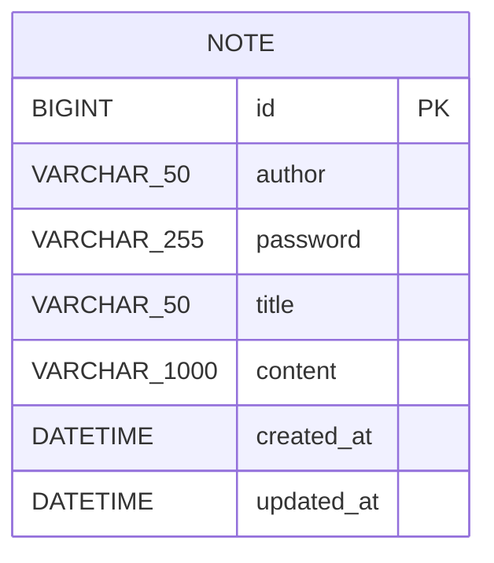

# just_note DB 스키마

로그인 계정이 없는 구조라 테이블은 `note` 하나면 충분하다. 작성자 정보(닉네임+비밀번호)는 note마다 독립적으로 저장된다.

## note 테이블

| 컬럼명 | 타입 | 제약조건 | 설명 |
|---|---|---|---|
| id | BIGINT | PK, AUTO_INCREMENT | 글 고유 식별자. 생성 순서와 일치하므로 정렬/페이지네이션 커서로도 사용 |
| author | VARCHAR(50) | NOT NULL | 작성자 닉네임 (앱에서 50바이트 제한 검증, 컬럼은 문자 수 기준이라 50이면 충분) |
| password | VARCHAR(255) | NOT NULL | bcrypt 해시값 (평문 저장 금지) |
| title | VARCHAR(50) | NOT NULL | 제목 |
| content | VARCHAR(1000) | NOT NULL | 마크다운 원문 |
| created_at | DATETIME | NOT NULL, DEFAULT CURRENT_TIMESTAMP | 작성 시각 |
| updated_at | DATETIME | NOT NULL, DEFAULT CURRENT_TIMESTAMP ON UPDATE CURRENT_TIMESTAMP | 수정 시각. created_at과 다르면 "수정됨"으로 판단 (별도 boolean 컬럼 불필요) |

인덱스: `author` 컬럼에 인덱스 추가 (find 조회 시 `WHERE author = ?`로 후보군을 먼저 좁히고, 비밀번호는 애플리케이션에서 bcrypt.compare로 개별 검증)

## CREATE TABLE

```sql
CREATE TABLE note (
    id BIGINT AUTO_INCREMENT PRIMARY KEY,
    author VARCHAR(50) NOT NULL,
    password VARCHAR(255) NOT NULL,
    title VARCHAR(50) NOT NULL,
    content VARCHAR(1000) NOT NULL,
    created_at DATETIME NOT NULL DEFAULT CURRENT_TIMESTAMP,
    updated_at DATETIME NOT NULL DEFAULT CURRENT_TIMESTAMP ON UPDATE CURRENT_TIMESTAMP,
    INDEX idx_author (author)
) ENGINE=InnoDB DEFAULT CHARSET=utf8mb4 COLLATE=utf8mb4_unicode_ci;
```

이 프로젝트는 `ddl-auto=update`로 Hibernate가 JPA Entity를 보고 테이블을 자동 생성하므로, 위 SQL은 직접 실행할 필요 없이 Entity 클래스 설계 참고용으로 쓰면 된다. 실제 컬럼명은 Entity 필드명(camelCase, 예: `passwordHash`)에서 자동 변환된 snake_case(`password_hash`)를 따른다.

## ERD

테이블이 하나뿐이라 관계는 없다.



## 비밀번호 조회 관련 주의사항

bcrypt는 같은 평문이라도 매번 다른 해시값을 생성하므로(salt 포함), SQL로 `WHERE password = ?` 형태의 직접 비교는 불가능하다. find 기능 구현 시:

1. `WHERE author = ?`로 해당 닉네임의 note를 전부 조회
2. 각 row의 저장된 해시값과 입력받은 비밀번호를 `bcrypt.compare()` (또는 Spring Security의 `PasswordEncoder.matches()`)로 애플리케이션 레벨에서 개별 검증
3. 일치하는 note만 필터링해서 반환

update/delete 시에도 동일하게, 대상 note를 id로 조회한 뒤 저장된 해시값과 입력 비밀번호를 `matches()`로 검증하는 방식으로 처리한다.
